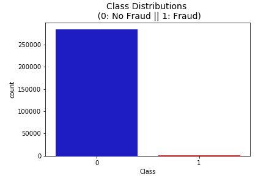

# Credit Card Fraud Detection

In this simple project we are going to demostrate how modern AI techniques can be used to do credit card fraud detection. 

### Data Used.
We are going to use open source dataset available on Kaggle. Here is the link to the dataset https://www.kaggle.com/mlg-ulb/creditcardfraud. Download the dataset and put into the same folder the notebook is in. 

The datasets contains transactions made by credit cards in September 2013 by european cardholders. This dataset presents transactions that occurred in two days, where we have 492 frauds out of 284,807 transactions. The dataset is highly unbalanced, the positive class (frauds) account for 0.172% of all transactions.

### How to use the notebook. 
 1. Download the dataset from kaggle and put into same folder with the notebook.
 2. Clone the repository. 
 3. Run the notebook and you will be able to see the results and plots of the data showing different patterns. 

### Models used. 
We have used simple models and not the very complex techniques as that is not something that we can open source. The following algorithms are used 
 1. LogisticRegression
 2. DecisionTree
 3. Support Vector Machine
 4. K-Neighbours 

We have not used deep learning models as it requires much more data to get better results and the dataset is not big as well as skewed. 

### Visualizations 
 #### Class imbalance 
  
 * WE can see big imbalance in our two classes here. 

 #### Distribution of amount and time
 
 * The time and amount are distributed as shown in figures.

 #### Correlation of imbalanced data
 
 * The correlation of different features are plotted in the matrix.
 * We can see there is not much correlation here. 

 #### Correlation of balanced data
 
 * We can see the correlation is high compared to unbalance data. 

 #### Confusion matrix
 
 * This is the confusion matrix of Logistic Regression model for fraud and non-fraud transaction.
